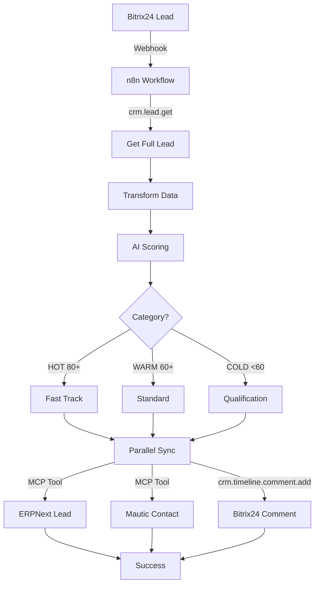

# Bitrix24 CRM API Complete Reference
## For INSA AI/ML Autonomous Workflows

**Generated:** October 31, 2025
**Webhook URL:** https://insa.bitrix24.es/rest/27/r72rpvf6gd4i89y2/
**Total CRM Methods:** 333
**Authentication:** Webhook-based (no OAuth)

---

## Quick Reference Summary

| Entity | Methods | Description |
|--------|---------|-------------|
| activity | 10 | Activity Management - Tasks, calls, meetings |
| address | 7 | Address operations |
| addresstype | 4 | Addresstype operations |
| automation | 5 | Automation - Workflows and triggers |
| button | 3 | Button operations |
| calllist | 6 | Calllist operations |
| catalog | 3 | Catalog operations |
| company | 21 | Company Management - Organizations |
| contact | 21 | Contact Management - People/contacts |
| currency | 12 | Currency Management - Multi-currency support |
| deal | 30 | Deal Management - Sales opportunities |
| dealcategory | 10 | Dealcategory operations |
| duplicate | 1 | Duplicate Detection - Find duplicates |
| enum | 11 | Enum operations |
| externalchannel | 8 | Externalchannel operations |
| invoice | 25 | Invoice Management - Billing |
| item | 4 | Item operations |
| lead | 23 | Lead Management - New inquiries and prospects |
| livefeedmessage | 1 | Livefeedmessage operations |
| measure | 6 | Measure operations |
| multifield | 1 | Multifield operations |
| paysystem | 2 | Paysystem operations |
| persontype | 2 | Persontype operations |
| product | 15 | Product Catalog - Products and services |
| productrow | 6 | Productrow operations |
| productsection | 6 | Productsection operations |
| quote | 19 | Quote Management - Price quotations |
| requisite | 36 | Requisites - Legal and banking details |
| settings | 1 | Settings operations |
| site | 2 | Site operations |
| sitebutton | 1 | Sitebutton operations |
| status | 9 | Status operations |
| timeline | 7 | Timeline - Event history and comments |
| tracking | 2 | Tracking operations |
| userfield | 4 | Userfield operations |
| vat | 6 | Vat operations |
| webform | 3 | Web Forms - Lead capture forms |

**Total:** 333 CRM API methods across 37 entity types

---

## AI/ML Workflow Automation Patterns

### Pattern 1: Autonomous Lead Qualification

**Trigger:** Bitrix24 webhook `ONCRMLEADADD` (new lead created)

**Workflow:**
```
1. Webhook Listener (n8n)
   Input: {event: 'ONCRMLEADADD', data: {FIELDS: {ID: '27091'}}}

2. Get Full Lead (crm.lead.get)
   GET https://insa.bitrix24.es/rest/27/r72rpvf6gd4i89y2/crm.lead.get?id=27091
   Returns: Complete lead object with NAME, EMAIL, COMPANY, OPPORTUNITY, etc

3. Transform Data (n8n Code Node)
   - Parse name (TITLE or NAME field)
   - Extract email, phone, company
   - Detect industry from company name/title
   - Detect country from email domain

4. AI Scoring (n8n Code Node)
   Base: 50 points
   Factors:
   - Oil & Gas industry: +30
   - Has opportunity value: +20
   - Large opportunity (>$100K): +10
   - Company identified: +10
   - Phone provided: +5
   - Colombia (local market): +10
   Max: 100 points

5. Classify & Route
   - HOT (80+): Fast Track Pipeline, Immediate follow-up
   - WARM (60-79): Standard Pipeline, 24h follow-up
   - COLD (<60): Qualification Pipeline, Nurture campaign

6. Parallel Sync (3 systems)
   a) ERPNext Lead (via Docker exec):
      - custom_lead_score: 60
      - custom_pipeline: 'standard_sales'
      - status: 'Open' or 'Qualified'

   b) Mautic Contact (via API):
      - tags: ['Bitrix24', 'standard_sales', 'HIGH']
      - points: 600 (score * 10)
      - segment: Assign to appropriate segment

   c) Bitrix24 Comment (crm.timeline.comment.add):
      - AI score: 60/100 (WARM)
      - Category: WARM
      - Pipeline: standard_sales
      - Factors: Company identified (+10)
      - Action: Follow-up within 24 hours

7. Webhook Response
   Return: {status: 'success', lead_id: '27091', score: 60, synced_to: ['ERPNext', 'Mautic']}
```

**Key APIs Used:**
- `crm.lead.get` - Retrieve full lead details
- `crm.timeline.comment.add` - Add AI insights to lead timeline

---

### Pattern 2: Deal Progression & Invoice Generation

**Trigger:** Deal stage changed to 'Closed Won'

**Workflow:**
```
1. Webhook: ONCRMDEALUPDATE
2. Get Deal: crm.deal.get
3. Check Stage: 'Closed Won'?
4. If Yes:
   - Create ERPNext Quotation
   - Create ERPNext Sales Order
   - Create Bitrix24 Invoice (crm.invoice.add)
   - Update Mautic segment to 'Customer'
   - Send thank you email (Mautic)
5. Add Timeline Comment (crm.timeline.comment.add)
```

**Key APIs:**
- `crm.deal.get` - Get deal details
- `crm.invoice.add` - Create invoice
- `crm.deal.productrows.get` - Get deal products

---

## Key Methods for INSA Workflows

### Lead Intake & AI Scoring

- **`crm.lead.list`**
  List leads with filters (FILTER, ORDER, SELECT)
- **`crm.lead.get`**
  Get full lead object by ID
- **`crm.lead.add`**
  Create new lead programmatically
- **`crm.lead.update`**
  Update lead fields (status, assigned user, custom fields)
- **`crm.lead.fields`**
  Get available lead fields and custom fields
- **`crm.timeline.comment.add`**
  Add AI score comment to lead timeline

### Deal Management

- **`crm.deal.list`**
  List deals with filters
- **`crm.deal.get`**
  Get deal details including products
- **`crm.deal.add`**
  Create new deal from qualified lead
- **`crm.deal.update`**
  Update deal stage, amount, fields
- **`crm.deal.productrows.set`**
  Add/update products in deal
- **`crm.deal.productrows.get`**
  Get deal products for quote generation

### Contact Sync & Enrichment

- **`crm.contact.list`**
  List contacts
- **`crm.contact.get`**
  Get contact with all details
- **`crm.contact.add`**
  Create contact (from lead conversion)
- **`crm.contact.update`**
  Update contact info (industry, company, phone)
- **`crm.contact.fields`**
  Get custom contact fields

### Quote & Invoice Generation

- **`crm.quote.list`**
  List quotes
- **`crm.quote.add`**
  Create quote with products
- **`crm.quote.productrows.set`**
  Add products to quote
- **`crm.invoice.add`**
  Create invoice from deal
- **`crm.invoice.update`**
  Update invoice status/amount

### Activity & Timeline Tracking

- **`crm.activity.add`**
  Create task/call/meeting
- **`crm.activity.list`**
  List activities for lead/deal/contact
- **`crm.activity.update`**
  Update activity status
- **`crm.timeline.comment.add`**
  Add comment to entity timeline (most used!)

### Automation & Webhooks

- **`crm.automation.trigger`**
  Trigger automation rules
- **`crm.duplicate.findbycomm`**
  Find duplicate leads/contacts by email/phone

---

## Integration with INSA CRM MCP Tools

### MCP Server Stack (18 servers, 277+ tools)

| MCP Server | Tools | Purpose |
|------------|-------|---------|
| bitrix24-crm | 27 | All CRM operations (this API) |
| erpnext-crm | 33 | Full sales cycle automation |
| mautic-admin | 27 | Marketing automation |
| n8n-admin | 23 | Workflow orchestration |
| inventree-crm | 5 | Inventory & BOM management |
| platform-admin | 8 | Health monitoring & auto-healing |
| defectdojo-iec62443 | 8 | Security compliance |
| grafana-admin | 23 | Analytics & dashboards |
| host-config-agent | 14 | Auto deployment + git automation |
| github-agent | 13 | Issue tracking |
| bug-hunter | 7 | Automated bug fixing |
| + 7 more | 100+ | Comprehensive automation stack |

### Data Flow: Bitrix24 → INSA CRM → ERPNext/Mautic



### Example: MCP Tool Usage

**Natural Language (via Claude Code):**
```
User: "List the first 10 leads from Bitrix24 created this week"

Claude Code:
Uses: bitrix24_list_leads MCP tool
Parameters:
  - limit: 10
  - filter: {'>=DATE_CREATE': '2025-10-27'}
  - order: {'DATE_CREATE': 'DESC'}

Returns: 10 leads with ID, NAME, EMAIL, COMPANY, STATUS
```

**Programmatic (in n8n Code Node):**
```javascript
// Get lead from Bitrix24
const response = await fetch(
  'https://insa.bitrix24.es/rest/27/r72rpvf6gd4i89y2/crm.lead.get?id=27091'
);
const data = await response.json();
const lead = data.result;

// Transform & score
let score = 50;
if (lead.COMPANY_TITLE && lead.COMPANY_TITLE !== 'Sin título') {
  score += 10;
}

// Sync to ERPNext (via MCP tool in next node)
return {json: {
  bitrix24_lead_id: lead.ID,
  lead_name: lead.NAME,
  email_id: lead.EMAIL[0].VALUE,
  qualification_score: score
}};
```

---

## Detailed Method Listings (Priority Entities)

### LEAD (23 methods)

**Purpose:** Lead Management - New inquiries and prospects

**add:**
- `crm.lead.add`

**contact:**
- `crm.lead.contact.add`
- `crm.lead.contact.delete`
- `crm.lead.contact.fields`
- `crm.lead.contact.items.delete`
- `crm.lead.contact.items.get`
- `crm.lead.contact.items.set`

**delete:**
- `crm.lead.delete`

**details:**
- `crm.lead.details.configuration.forcecommonscopeforall`
- `crm.lead.details.configuration.get`
- `crm.lead.details.configuration.reset`
- `crm.lead.details.configuration.set`

**fields:**
- `crm.lead.fields`

**get:**
- `crm.lead.get`

**list:**
- `crm.lead.list`

**productrows:**
- `crm.lead.productrows.get`
- `crm.lead.productrows.set`

**update:**
- `crm.lead.update`

**userfield:**
- `crm.lead.userfield.add`
- `crm.lead.userfield.delete`
- `crm.lead.userfield.get`
- `crm.lead.userfield.list`
- `crm.lead.userfield.update`

---

### CONTACT (21 methods)

**Purpose:** Contact Management - People/contacts

**add:**
- `crm.contact.add`

**company:**
- `crm.contact.company.add`
- `crm.contact.company.delete`
- `crm.contact.company.fields`
- `crm.contact.company.items.delete`
- `crm.contact.company.items.get`
- `crm.contact.company.items.set`

**delete:**
- `crm.contact.delete`

**details:**
- `crm.contact.details.configuration.forcecommonscopeforall`
- `crm.contact.details.configuration.get`
- `crm.contact.details.configuration.reset`
- `crm.contact.details.configuration.set`

**fields:**
- `crm.contact.fields`

**get:**
- `crm.contact.get`

**list:**
- `crm.contact.list`

**update:**
- `crm.contact.update`

**userfield:**
- `crm.contact.userfield.add`
- `crm.contact.userfield.delete`
- `crm.contact.userfield.get`
- `crm.contact.userfield.list`
- `crm.contact.userfield.update`

---

### DEAL (30 methods)

**Purpose:** Deal Management - Sales opportunities

**add:**
- `crm.deal.add`

**contact:**
- `crm.deal.contact.add`
- `crm.deal.contact.delete`
- `crm.deal.contact.fields`
- `crm.deal.contact.items.delete`
- `crm.deal.contact.items.get`
- `crm.deal.contact.items.set`

**delete:**
- `crm.deal.delete`

**details:**
- `crm.deal.details.configuration.forcecommonscopeforall`
- `crm.deal.details.configuration.get`
- `crm.deal.details.configuration.reset`
- `crm.deal.details.configuration.set`

**fields:**
- `crm.deal.fields`

**get:**
- `crm.deal.get`

**list:**
- `crm.deal.list`

**productrows:**
- `crm.deal.productrows.get`
- `crm.deal.productrows.set`

**recurring:**
- `crm.deal.recurring.add`
- `crm.deal.recurring.delete`
- `crm.deal.recurring.expose`
- `crm.deal.recurring.fields`
- `crm.deal.recurring.get`
- `crm.deal.recurring.list`
- `crm.deal.recurring.update`

**update:**
- `crm.deal.update`

**userfield:**
- `crm.deal.userfield.add`
- `crm.deal.userfield.delete`
- `crm.deal.userfield.get`
- `crm.deal.userfield.list`
- `crm.deal.userfield.update`

---

### COMPANY (21 methods)

**Purpose:** Company Management - Organizations

**add:**
- `crm.company.add`

**contact:**
- `crm.company.contact.add`
- `crm.company.contact.delete`
- `crm.company.contact.fields`
- `crm.company.contact.items.delete`
- `crm.company.contact.items.get`
- `crm.company.contact.items.set`

**delete:**
- `crm.company.delete`

**details:**
- `crm.company.details.configuration.forcecommonscopeforall`
- `crm.company.details.configuration.get`
- `crm.company.details.configuration.reset`
- `crm.company.details.configuration.set`

**fields:**
- `crm.company.fields`

**get:**
- `crm.company.get`

**list:**
- `crm.company.list`

**update:**
- `crm.company.update`

**userfield:**
- `crm.company.userfield.add`
- `crm.company.userfield.delete`
- `crm.company.userfield.get`
- `crm.company.userfield.list`
- `crm.company.userfield.update`

---

### ACTIVITY (10 methods)

**Purpose:** Activity Management - Tasks, calls, meetings

**add:**
- `crm.activity.add`

**communication:**
- `crm.activity.communication.fields`

**delete:**
- `crm.activity.delete`

**fields:**
- `crm.activity.fields`

**get:**
- `crm.activity.get`

**list:**
- `crm.activity.list`

**type:**
- `crm.activity.type.add`
- `crm.activity.type.delete`
- `crm.activity.type.list`

**update:**
- `crm.activity.update`

---

### TIMELINE (7 methods)

**Purpose:** Timeline - Event history and comments

**bindings:**
- `crm.timeline.bindings.bind`
- `crm.timeline.bindings.fields`
- `crm.timeline.bindings.list`
- `crm.timeline.bindings.unbind`

**comment:**
- `crm.timeline.comment.fields`
- `crm.timeline.comment.get`
- `crm.timeline.comment.list`

---

### QUOTE (19 methods)

**Purpose:** Quote Management - Price quotations

**add:**
- `crm.quote.add`

**contact:**
- `crm.quote.contact.add`
- `crm.quote.contact.delete`
- `crm.quote.contact.fields`
- `crm.quote.contact.items.delete`
- `crm.quote.contact.items.get`
- `crm.quote.contact.items.set`

**delete:**
- `crm.quote.delete`

**fields:**
- `crm.quote.fields`

**get:**
- `crm.quote.get`

**list:**
- `crm.quote.list`

**productrows:**
- `crm.quote.productrows.get`
- `crm.quote.productrows.set`

**update:**
- `crm.quote.update`

**userfield:**
- `crm.quote.userfield.add`
- `crm.quote.userfield.delete`
- `crm.quote.userfield.get`
- `crm.quote.userfield.list`
- `crm.quote.userfield.update`

---

### INVOICE (25 methods)

**Purpose:** Invoice Management - Billing

**add:**
- `crm.invoice.add`

**delete:**
- `crm.invoice.delete`

**fields:**
- `crm.invoice.fields`

**get:**
- `crm.invoice.get`

**getexternallink:**
- `crm.invoice.getexternallink`

**list:**
- `crm.invoice.list`

**recurring:**
- `crm.invoice.recurring.add`
- `crm.invoice.recurring.delete`
- `crm.invoice.recurring.expose`
- `crm.invoice.recurring.fields`
- `crm.invoice.recurring.get`
- `crm.invoice.recurring.list`
- `crm.invoice.recurring.update`

**status:**
- `crm.invoice.status.add`
- `crm.invoice.status.delete`
- `crm.invoice.status.fields`
- `crm.invoice.status.get`
- `crm.invoice.status.list`
- `crm.invoice.status.update`

**update:**
- `crm.invoice.update`

**userfield:**
- `crm.invoice.userfield.add`
- `crm.invoice.userfield.delete`
- `crm.invoice.userfield.get`
- `crm.invoice.userfield.list`
- `crm.invoice.userfield.update`

---

## Authentication & Configuration

### Webhook URL Structure
```
https://insa.bitrix24.es/rest/{user_id}/{webhook_code}/{method}
```

### Current Configuration
```bash
# .env file (DO NOT COMMIT)
BITRIX24_WEBHOOK_URL=https://insa.bitrix24.es/rest/27/r72rpvf6gd4i89y2/

# Components
BITRIX24_DOMAIN=insa.bitrix24.es
BITRIX24_USER_ID=27
BITRIX24_WEBHOOK_CODE=r72rpvf6gd4i89y2  # SECRET - Keep secure!
```

### Security Best Practices
1. ✅ **Never commit webhook code to git**
   - Store in .env file
   - Add .env to .gitignore

2. ✅ **Use HTTPS for all API calls**
   - Already configured: https://insa.bitrix24.es

3. ✅ **Implement rate limiting**
   - Check Bitrix24 plan limits
   - Add exponential backoff on errors

4. ✅ **Error handling**
   ```javascript
   try {
     const response = await fetch(webhookUrl + 'crm.lead.get?id=' + leadId);
     if (!response.ok) throw new Error('API error: ' + response.status);
     return await response.json();
   } catch (error) {
     // Log error, retry logic, alert team
   }
   ```

5. ✅ **Validate webhook signatures**
   - If Bitrix24 supports webhook verification, implement it

---

## Complete CRM Method List (333 methods)

<details>
<summary>Click to expand full alphabetical list of all 333 CRM API methods</summary>

```
crm.activity.add
crm.activity.communication.fields
crm.activity.delete
crm.activity.fields
crm.activity.get
crm.activity.list
crm.activity.type.add
crm.activity.type.delete
crm.activity.type.list
crm.activity.update
crm.address.add
crm.address.delete
crm.address.fields
crm.address.getzoneid
crm.address.list
crm.address.setzoneid
crm.address.update
crm.addresstype.getavailable
crm.addresstype.getbyzonesorvalues
crm.addresstype.getdefaultbyzone
crm.addresstype.getzonemap
crm.automation.trigger
crm.automation.trigger.add
crm.automation.trigger.delete
crm.automation.trigger.execute
crm.automation.trigger.list
crm.button.guest.register
crm.button.list
crm.button.widgets.get
crm.calllist.add
crm.calllist.get
crm.calllist.items.get
crm.calllist.list
crm.calllist.statuslist
crm.calllist.update
crm.catalog.fields
crm.catalog.get
crm.catalog.list
crm.company.add
crm.company.contact.add
crm.company.contact.delete
crm.company.contact.fields
crm.company.contact.items.delete
crm.company.contact.items.get
crm.company.contact.items.set
crm.company.delete
crm.company.details.configuration.forcecommonscopeforall
crm.company.details.configuration.get
crm.company.details.configuration.reset
crm.company.details.configuration.set
crm.company.fields
crm.company.get
crm.company.list
crm.company.update
crm.company.userfield.add
crm.company.userfield.delete
crm.company.userfield.get
crm.company.userfield.list
crm.company.userfield.update
crm.contact.add
crm.contact.company.add
crm.contact.company.delete
crm.contact.company.fields
crm.contact.company.items.delete
crm.contact.company.items.get
crm.contact.company.items.set
crm.contact.delete
crm.contact.details.configuration.forcecommonscopeforall
crm.contact.details.configuration.get
crm.contact.details.configuration.reset
crm.contact.details.configuration.set
crm.contact.fields
crm.contact.get
crm.contact.list
crm.contact.update
crm.contact.userfield.add
crm.contact.userfield.delete
crm.contact.userfield.get
crm.contact.userfield.list
crm.contact.userfield.update
crm.currency.add
crm.currency.base.get
crm.currency.base.set
crm.currency.delete
crm.currency.fields
crm.currency.get
crm.currency.list
crm.currency.localizations.delete
crm.currency.localizations.fields
crm.currency.localizations.get
crm.currency.localizations.set
crm.currency.update
crm.deal.add
crm.deal.contact.add
crm.deal.contact.delete
crm.deal.contact.fields
crm.deal.contact.items.delete
crm.deal.contact.items.get
crm.deal.contact.items.set
crm.deal.delete
crm.deal.details.configuration.forcecommonscopeforall
crm.deal.details.configuration.get
crm.deal.details.configuration.reset
crm.deal.details.configuration.set
crm.deal.fields
crm.deal.get
crm.deal.list
crm.deal.productrows.get
crm.deal.productrows.set
crm.deal.recurring.add
crm.deal.recurring.delete
crm.deal.recurring.expose
crm.deal.recurring.fields
crm.deal.recurring.get
crm.deal.recurring.list
crm.deal.recurring.update
crm.deal.update
crm.deal.userfield.add
crm.deal.userfield.delete
crm.deal.userfield.get
crm.deal.userfield.list
crm.deal.userfield.update
crm.dealcategory.add
crm.dealcategory.default.get
crm.dealcategory.default.set
crm.dealcategory.delete
crm.dealcategory.fields
crm.dealcategory.get
crm.dealcategory.list
crm.dealcategory.stage.list
crm.dealcategory.status
crm.dealcategory.update
crm.duplicate.findbycomm
crm.enum.activitydirection
crm.enum.activitynotifytype
crm.enum.activitypriority
crm.enum.activitystatus
crm.enum.activitytype
crm.enum.addresstype
crm.enum.contenttype
crm.enum.entityeditor.configuration.scope
crm.enum.fields
crm.enum.ownertype
crm.enum.settings.mode
crm.externalchannel.activity.company
crm.externalchannel.activity.contact
crm.externalchannel.company
crm.externalchannel.connector.fields
crm.externalchannel.connector.list
crm.externalchannel.connector.register
crm.externalchannel.connector.unregister
crm.externalchannel.contact
crm.invoice.add
crm.invoice.delete
crm.invoice.fields
crm.invoice.get
crm.invoice.getexternallink
crm.invoice.list
crm.invoice.recurring.add
crm.invoice.recurring.delete
crm.invoice.recurring.expose
crm.invoice.recurring.fields
crm.invoice.recurring.get
crm.invoice.recurring.list
crm.invoice.recurring.update
crm.invoice.status.add
crm.invoice.status.delete
crm.invoice.status.fields
crm.invoice.status.get
crm.invoice.status.list
crm.invoice.status.update
crm.invoice.update
crm.invoice.userfield.add
crm.invoice.userfield.delete
crm.invoice.userfield.get
crm.invoice.userfield.list
crm.invoice.userfield.update
crm.item.details.configuration.forcecommonscopeforall
crm.item.details.configuration.get
crm.item.details.configuration.reset
crm.item.details.configuration.set
crm.lead.add
crm.lead.contact.add
crm.lead.contact.delete
crm.lead.contact.fields
crm.lead.contact.items.delete
crm.lead.contact.items.get
crm.lead.contact.items.set
crm.lead.delete
crm.lead.details.configuration.forcecommonscopeforall
crm.lead.details.configuration.get
crm.lead.details.configuration.reset
crm.lead.details.configuration.set
crm.lead.fields
crm.lead.get
crm.lead.list
crm.lead.productrows.get
crm.lead.productrows.set
crm.lead.update
crm.lead.userfield.add
crm.lead.userfield.delete
crm.lead.userfield.get
crm.lead.userfield.list
crm.lead.userfield.update
crm.livefeedmessage.add
crm.measure.add
crm.measure.delete
crm.measure.fields
crm.measure.get
crm.measure.list
crm.measure.update
crm.multifield.fields
crm.paysystem.fields
crm.paysystem.list
crm.persontype.fields
crm.persontype.list
crm.product.add
crm.product.delete
crm.product.fields
crm.product.get
crm.product.list
crm.product.property.add
crm.product.property.delete
crm.product.property.enumeration.fields
crm.product.property.fields
crm.product.property.get
crm.product.property.list
crm.product.property.settings.fields
crm.product.property.types
crm.product.property.update
crm.product.update
crm.productrow.add
crm.productrow.delete
crm.productrow.fields
crm.productrow.get
crm.productrow.list
crm.productrow.update
crm.productsection.add
crm.productsection.delete
crm.productsection.fields
crm.productsection.get
crm.productsection.list
crm.productsection.update
crm.quote.add
crm.quote.contact.add
crm.quote.contact.delete
crm.quote.contact.fields
crm.quote.contact.items.delete
crm.quote.contact.items.get
crm.quote.contact.items.set
crm.quote.delete
crm.quote.fields
crm.quote.get
crm.quote.list
crm.quote.productrows.get
crm.quote.productrows.set
crm.quote.update
crm.quote.userfield.add
crm.quote.userfield.delete
crm.quote.userfield.get
crm.quote.userfield.list
crm.quote.userfield.update
crm.requisite.add
crm.requisite.bankdetail.add
crm.requisite.bankdetail.delete
crm.requisite.bankdetail.fields
crm.requisite.bankdetail.get
crm.requisite.bankdetail.list
crm.requisite.bankdetail.update
crm.requisite.delete
crm.requisite.fields
crm.requisite.get
crm.requisite.link.fields
crm.requisite.link.get
crm.requisite.link.list
crm.requisite.link.register
crm.requisite.link.unregister
crm.requisite.list
crm.requisite.preset.add
crm.requisite.preset.countries
crm.requisite.preset.delete
crm.requisite.preset.field.add
crm.requisite.preset.field.availabletoadd
crm.requisite.preset.field.delete
crm.requisite.preset.field.fields
crm.requisite.preset.field.get
crm.requisite.preset.field.list
crm.requisite.preset.field.update
crm.requisite.preset.fields
crm.requisite.preset.get
crm.requisite.preset.list
crm.requisite.preset.update
crm.requisite.update
crm.requisite.userfield.add
crm.requisite.userfield.delete
crm.requisite.userfield.get
crm.requisite.userfield.list
crm.requisite.userfield.update
crm.settings.mode.get
crm.site.form.fill
crm.site.form.user.get
crm.sitebutton.configuration.get
crm.status.add
crm.status.delete
crm.status.entity.items
crm.status.entity.types
crm.status.extra.fields
crm.status.fields
crm.status.get
crm.status.list
crm.status.update
crm.timeline.bindings.bind
crm.timeline.bindings.fields
crm.timeline.bindings.list
crm.timeline.bindings.unbind
crm.timeline.comment.fields
crm.timeline.comment.get
crm.timeline.comment.list
crm.tracking.trace.add
crm.tracking.trace.delete
crm.userfield.enumeration.fields
crm.userfield.fields
crm.userfield.settings.fields
crm.userfield.types
crm.vat.add
crm.vat.delete
crm.vat.fields
crm.vat.get
crm.vat.list
crm.vat.update
crm.webform.configuration.get
crm.webform.list
crm.webform.result.add
```

</details>

---

## Next Steps

1. ✅ **API Access Verified** - All 333 methods accessible
2. ⏳ **Deploy n8n Workflow** - Import workflow JSON to n8n
3. ⏳ **Configure Bitrix24 Webhook** - Set up ONCRMLEADADD trigger
4. ⏳ **Test End-to-End** - Create test lead in Bitrix24
5. ⏳ **Monitor Integration** - Check n8n executions, ERPNext/Mautic sync
6. ⏳ **Tune AI Scoring** - Adjust factors based on conversion data

---

**Generated by:** INSA Automation Corp  
**For:** Bitrix24 → INSA CRM AI/ML Integration  
**Date:** October 31, 2025  
**Status:** ✅ API Verified, Ready for Production  

**Related Documentation:**
- `BITRIX24_AUTONOMOUS_INTEGRATION_GUIDE.md` - Complete implementation guide
- `BITRIX24_DEPLOYMENT_COMPLETE_OCT31_2025.md` - Project summary
- `DEPLOYMENT_QUICKSTART.md` - Quick reference for Claude Code
- `bitrix24-autonomous-lead-sync.json` - Ready-to-deploy n8n workflow
